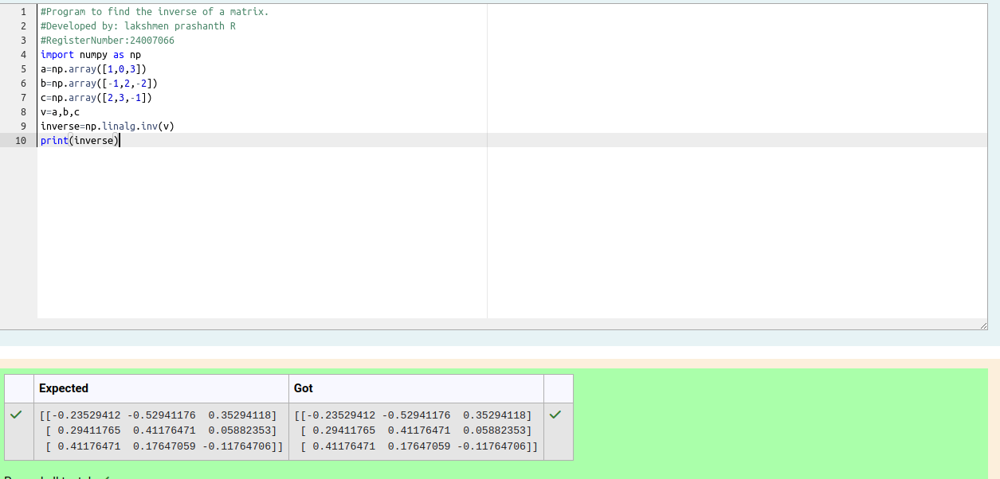

# INVERSE-OF-A-MATRIX
## Aim:
To write a python program to find the inverse of a matrix
## Equipment’s required:
1. 	Hardware – PCs
2. 	Anaconda – Python 3.7 Installation / Moodle-Code Runner
## Algorithm:
### Step1 : import the numpy module to use the built-in function for calculation.
### Step 2: prepare the lists from each row matrix and assign in np.array().
### Step 3: using the np.linalg.inv(),we can find the inverse of the given matrix.
### Step 4: End the program.

## Program:
````
#Program to find the inverse of a matrix.
#Developed by: lakshmen prashanth R
#RegisterNumber:24007066
import numpy as np
a=np.array([1,0,3])
b=np.array([-1,2,-2])
c=np.array([2,3,-1])
v=a,b,c
inverse=np.linalg.inv(v)
print(inverse)
````
## Output:

## Result:
Thus the inverse of given matrix is successfully solved using python program

